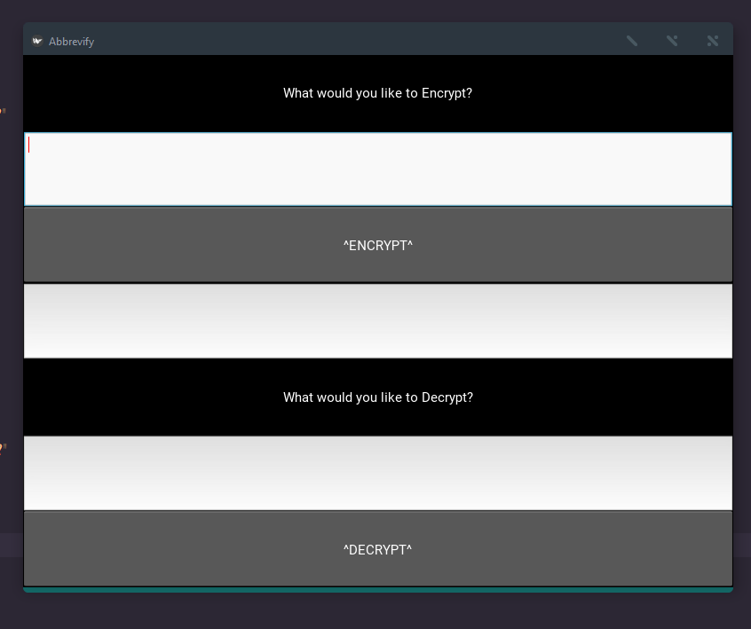
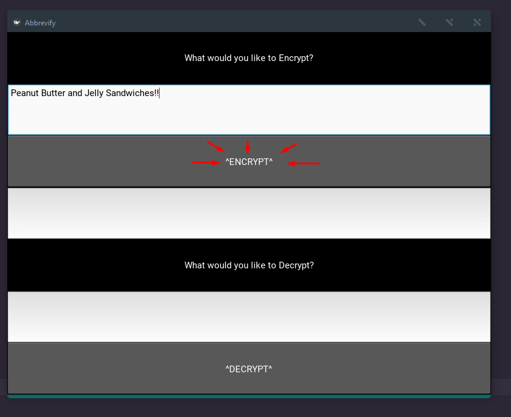
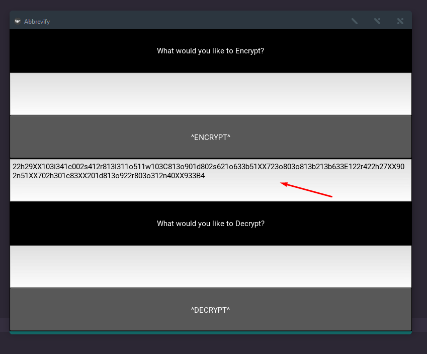
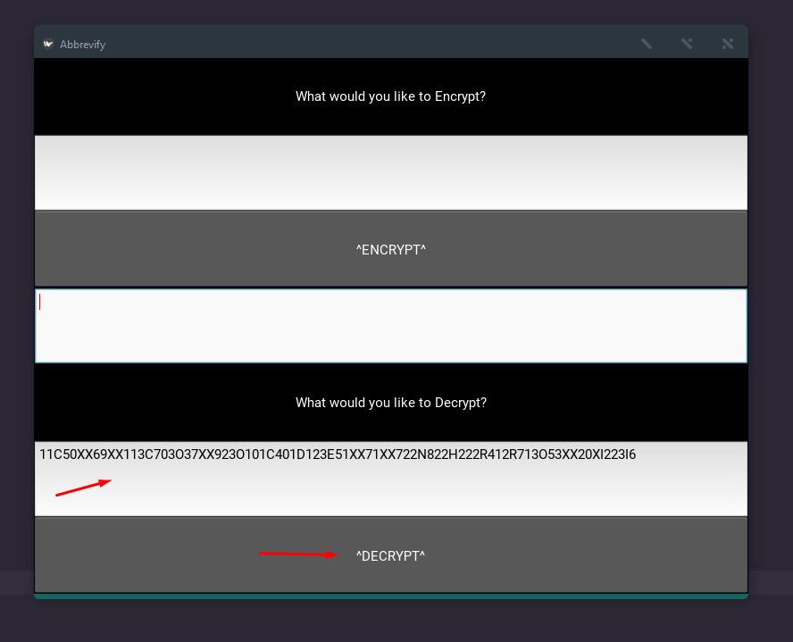
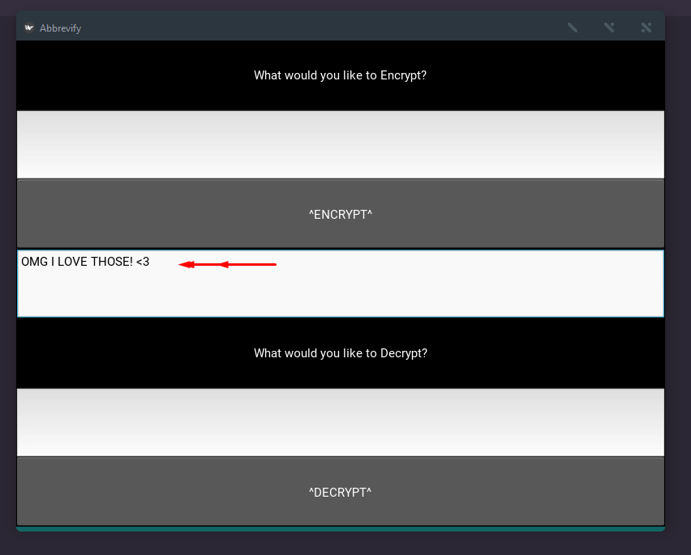

# Abbrevify 
**Cryptography Project based on IT Abbreviations**
<br>
<br>

## B.B..But what does it do?
**This basically _Encrypts_ and _Decrypts_ text messages into a code that nobody can understand unless they possess this _Encryptor_ / _Decryptor_**
<br>
<br>


## Dependencies
**since the UI is made using Kivy it is required for This UI version of Abbrevify.**

You can install Kivy *(along with it's dependencies)* with pip using the following commands
<br>
```
python -m pip install --upgrade pip wheel setuptools
python -m pip install docutils pygments pypiwin32 kivy.deps.sdl2 kivy.deps.glew
python -m pip install kivy.deps.gstreamer
python -m pip install kivy.deps.angle
python -m pip install pygame
python -m pip install kivy
```
<br>
<br>


## H..H..How do I use it Tho?
**Open Abbrevify.py to initiate the GUI version of Abbrevify**


<br>
<br>
<br>
**To Encrypt a message to send to your buddy Just input your message into the Encrypt textbox and press _ENCRYPT_**


<br>
<br>
<br>
**The encrypted message will appear in the _Result_ Textbox where you can copy it and send it to your buddy**


<br>
<br>
<br>
**when your buddy sends you an Encrypted message back then you can simply put the message into the DECRYPT textbox and press _DECRYPT_**


<br>
<br>
<br>
**The Decrypted message will once again appear in the RESULT textbox so you can read it!**




<p align="center">
  


## Anything else?
The encryption has nothing to do with Unicode so **English** is currently(_and probably forever_) the only supported language
<br>
<br>


 ## A special thanks!
 **To myself** for making this spaghetti code possible
